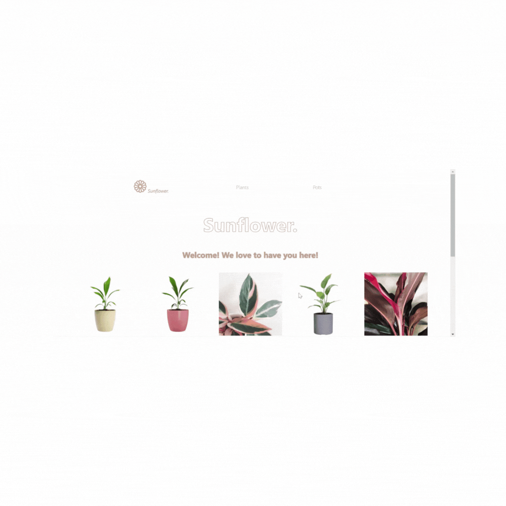

# SUNFLOWER

Ecommerce de plantas y macetas

## Comandos para ejecutar la App

Para poder clonar y ejecutar la app, se deberán realizar los siguientes pasos:

Correr el comando con el repositorio correspondiente:
###  `clone` https://github.com/micaelascanio/sunflower.git

Luego, correr el siguiente comando para instalar las dependencias, en la carpeta que se desee:
### `npm install`

Una vez completa la instalación, se deberá correr el siguiente comando para inicializar la app y poder así, ejecutar el servidor de desarrollo:
### `npm start`

## Gif de navegación

